# 🚀 Portfolio Vibe AI

> AI-Powered Resume → Portfolio Website Generator using Google Gemini

> 🚧 **Status:** Active Development (The complete implementation is maintained in a private repository as part of an ongoing product.)

---

# 🎥 Demo

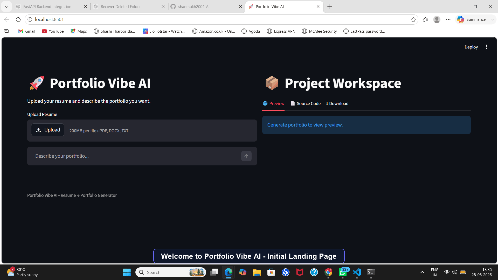

---

# 📌 Overview

Portfolio Vibe AI is an AI-powered application that automatically converts a user's resume into a professional portfolio website.

The application extracts information from PDF, DOCX, or TXT resumes, processes the resume using Google Gemini, generates structured portfolio data, creates a complete HTML/CSS/JavaScript portfolio website, provides a live preview, allows users to inspect the generated source code, and exports the project as a downloadable ZIP file.

This repository is intended to showcase the application workflow, user interface, architecture, and generated outputs for portfolio and interview purposes.

---

# 🛠 Technologies Used

- Python
- Streamlit
- Google Gemini
- Prompt Engineering
- HTML
- CSS
- JavaScript
- PyPDF
- python-docx
- python-dotenv

---

# ✨ Features

- 📄 Resume Upload (PDF, DOCX, TXT)
- 🧹 Resume Text Extraction & Cleaning
- 🤖 AI Portfolio Content Generation
- 🎨 HTML, CSS & JavaScript Website Generation
- 🌐 Live Portfolio Preview
- 💻 Generated Source Code Viewer
- 📦 Download Portfolio as ZIP
- ⚡ End-to-End AI Workflow

---

# 🏗️ System Architecture

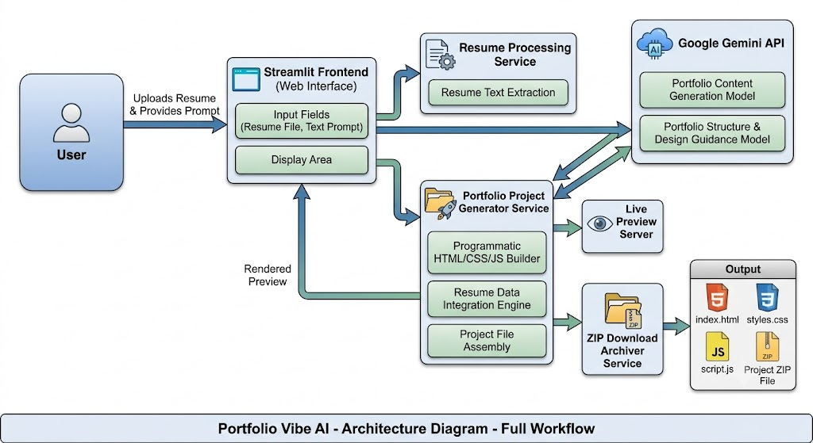

---

# 🔄 Workflow

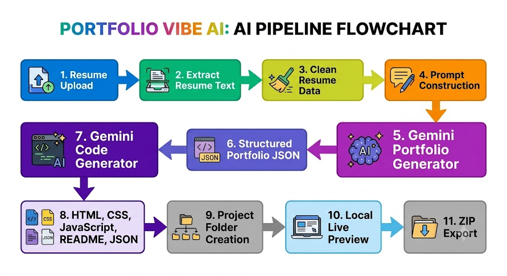

---

# 🖥️ User Interface

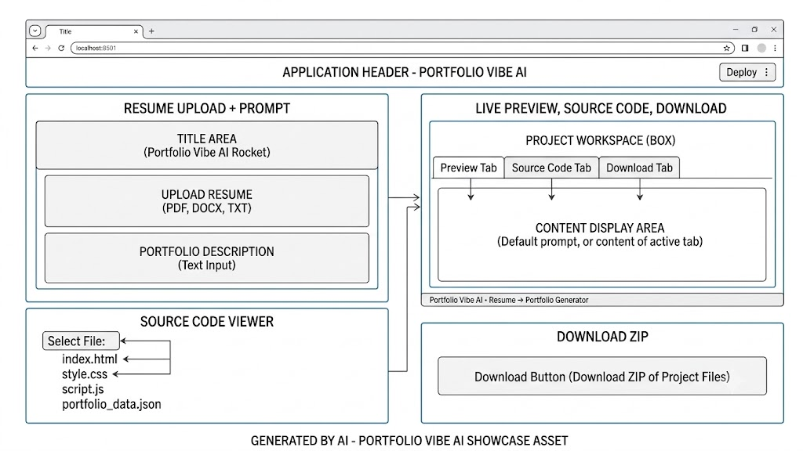

---

# 📸 Application Screenshots

## 🏠 Home

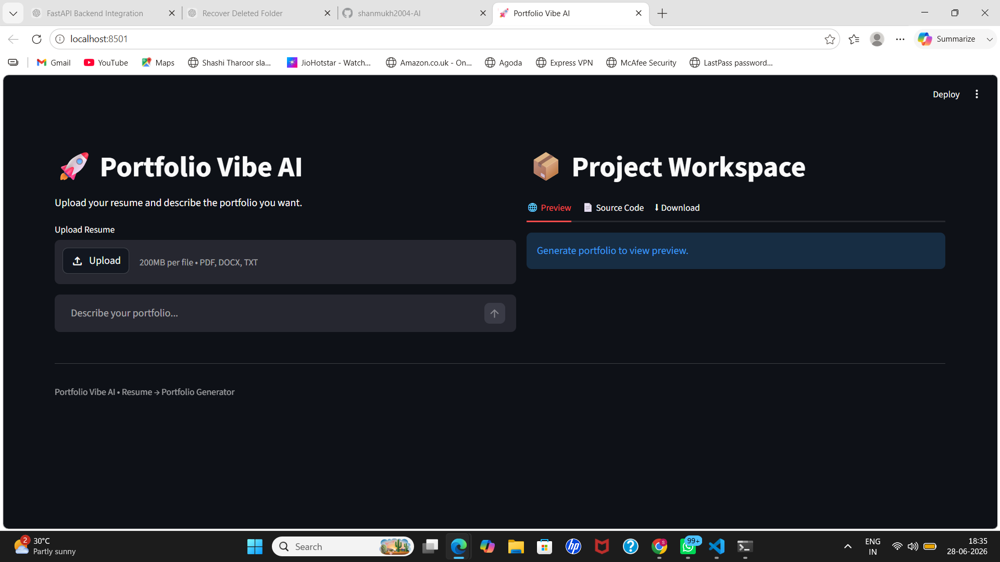

---

## 📄 Resume Upload

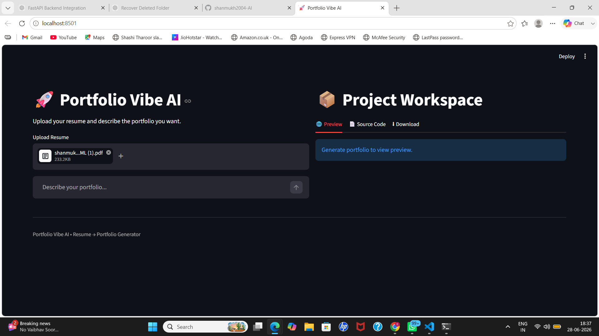

---

## ⚡ Portfolio Generation

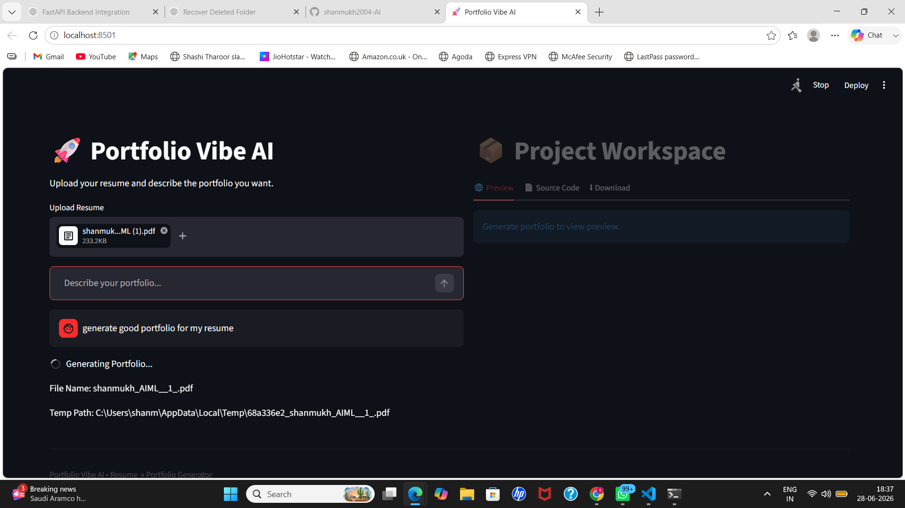

---

## 🌐 Live Preview

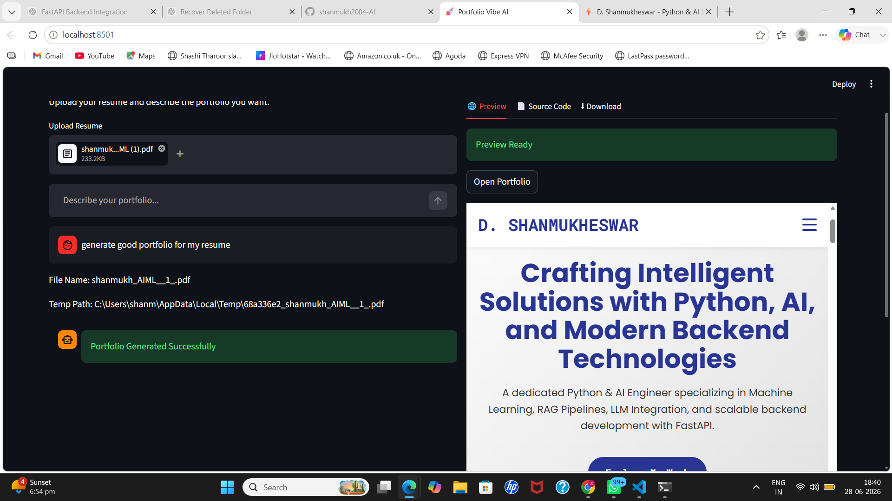

---

## 💻 Source Code Viewer

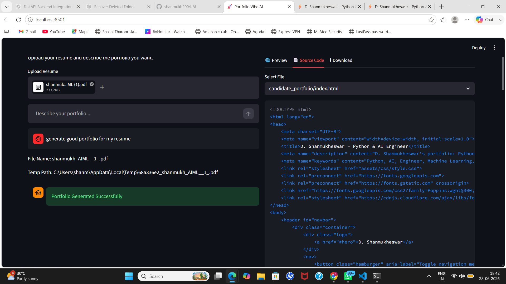

---

## 📦 Download Generated Portfolio

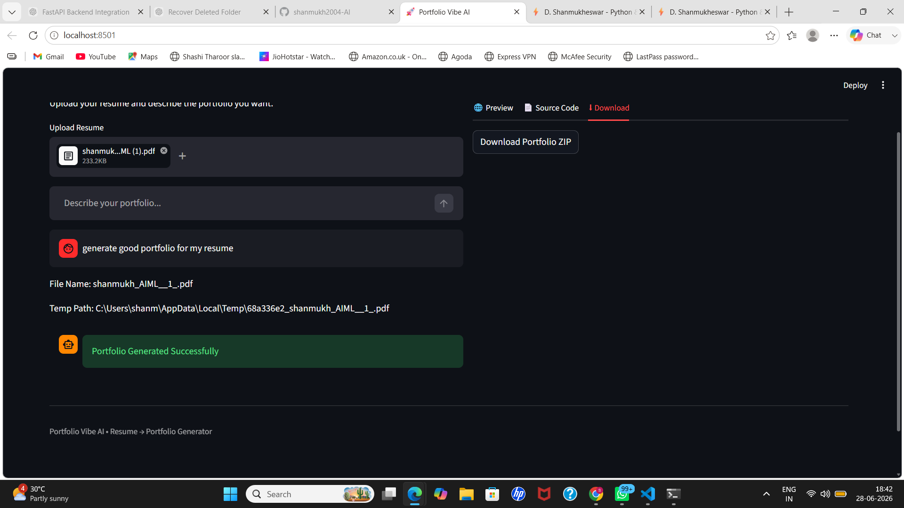

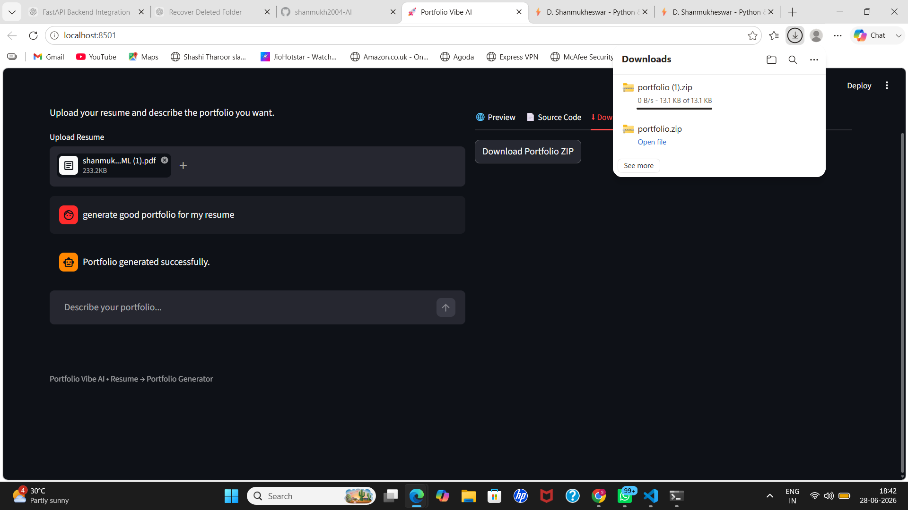

---

# 🧠 AI Pipeline

```text
Resume Upload
        │
        ▼
Resume Text Extraction
        │
        ▼
Data Cleaning
        │
        ▼
Google Gemini
        │
        ▼
Portfolio JSON Generation
        │
        ▼
HTML / CSS / JavaScript Generation
        │
        ▼
Project Folder Creation
        │
        ▼
Live Preview
        │
        ▼
ZIP Export
```

---

# 📁 Generated Output

```text
candidate_portfolio/

├── index.html
├── assets/
│   ├── css/
│   │   └── style.css
│   ├── js/
│   │   └── script.js
│   └── data/
│       └── portfolio_data.json
└── README.md
```

---

# 🛣️ Roadmap

Future enhancements include:

- React Portfolio Generation
- Next.js Portfolio Generation
- Multiple Portfolio Themes
- Portfolio Editor
- AI Theme Designer
- Multi-Page Portfolio Support
- Backend API Generation
- One-Click Cloud Deployment

---

# 🔒 Source Code

The complete implementation is currently maintained in a **private repository** because it is part of an ongoing product under active development.

This repository serves as a showcase of the project's:

- Features
- User Interface
- Architecture
- Workflow
- Generated Outputs

---

# 👨‍💻 Author

## DASARI SHANMUKHESWAR

**AI Engineer | NLP Engineer | Generative AI Developer**

Passionate about building end-to-end AI applications using Python, Large Language Models (LLMs), Natural Language Processing, Prompt Engineering, and Generative AI.

### Areas of Interest

- Generative AI
- Large Language Models (LLMs)
- Natural Language Processing (NLP)
- AI Agents
- Prompt Engineering
- Python Development
- AI Workflow Automation
- Streamlit Applications

📧 **Email:** shanmukh8324@gmail.com

---

⭐ Built as part of my Generative AI Engineering portfolio to demonstrate end-to-end AI application development using Large Language Models and Prompt Engineering.

---

## ⭐ Support

If you found this project interesting, please consider giving it a ⭐ on GitHub.

Feedback and suggestions are always welcome.

Thank you for visiting this repository!
